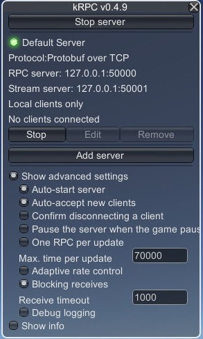
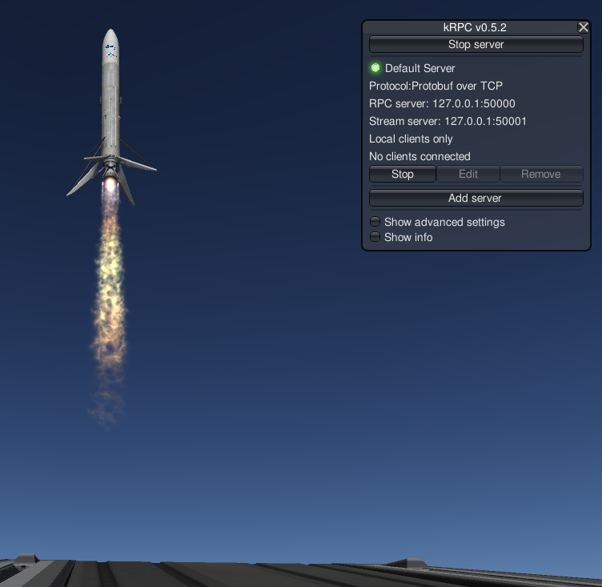

# ksp_bridge

ROS2 package for Kerbal Space Program based on the kRPC mod.

> **v0.x → v1.0 breaking change.** Vessel-body-frame quantities on `/vessel`
> are now published in aerospace FRD (`x=forward`, `y=right`, `z=down`,
> right-handed). KSP's native vessel frame (`x=right`, `y=forward`, `z=down`,
> left-handed) is no longer exposed. See "Frame conventions" below for the
> per-field contract.

Works with:  

+ KSP 1.12.5

+ kRPC 0.5.2

+ ROS2 Humble

+ Ubuntu 22.04

## Installation

### Install kRPC mod

Install the [kRPC mod](https://github.com/nullprofile/krpc) and it's dependencies.

### Clone repository and build the docker container

``` bash
git clone https://github.com/clausqr/ksp_bridge
cd ksp_bridge
docker build -t ksp_bridge:humble .
```

## Usage

### 1. Server settings inside KSP





**Note**: *Max. time per update* is required to be high, but it affects the framerate.

### 2. Running the docker container

``` bash
xhost +local:docker
docker run -it --rm --net=host -e DISPLAY=$DISPLAY -v /tmp/.X11-unix:/tmp/.X11-unix ksp_bridge:humble
```

### 3. inside the docker container

Resource monitor example:
``` bash
ros2 launch ksp_bridge_examples resource_monitor.launch.py
```

or 

Up and Down Launch example:
``` bash
ros2 launch ksp_bridge_examples up_and_down.launch.py
``` 

### 4. Development

(for fast reference, your workflow may vary)

Mount the repository inside the docker container:
``` bash
docker run -it --rm --net=host -e DISPLAY=$DISPLAY -v /tmp/.X11-unix:/tmp/.X11-unix -v $(pwd):/ws/ksp_bridge ksp_bridge:humble
```

Code your custom packets outside the container and build and test inside the container with:

``` bash
cd /ws/ksp_bridge
colcon build
source install/setup.bash
rqt &
ros2 run ksp_bridge_<your_custom_packet> <your_custom_launch_file>.launch.py
```

## The `ksp_bridge` node

### Parameters

| Parameter | Type | Default | Description |
|---|---|---|---|
| `publish_rate_hz` | `double` | `10.0` | Rate of the fast group: `/vessel`, `/vessel/control`, `/vessel/flight`, `/vessel/orbit`, TF. |
| `parts_publish_rate_hz` | `double` | `1.0` | Rate of `/vessel/parts`. Isolated because parts/resources iteration is O(parts × resources) per tick. |
| `bodies_publish_rate_hz` | `double` | `1.0` | Rate of `/celestial_bodies` (mostly static physics constants). |
| `celestial_bodies` | `string[]` | `["kerbin"]` | Bodies to publish on `/celestial_bodies`. `kerbin` is always added. |

All three rates are validated: values `≤ 0` are rejected at startup, values `> 50 Hz` are warned but not clamped. 50 Hz is the kRPC physics-tick ceiling (Unity `FixedUpdate`, 25 Hz under load); polling faster yields duplicate samples from the same physics frame unless the in-game kRPC option *"Blocking receives"* is enabled.

### Topics

Published:

- `/vessel` — `ksp_bridge_interfaces/Vessel`
- `/vessel/control` — `ksp_bridge_interfaces/Control`
- `/vessel/flight` — `ksp_bridge_interfaces/Flight`
- `/vessel/orbit` — `ksp_bridge_interfaces/Orbit`
- `/vessel/parts` — `ksp_bridge_interfaces/Parts`
- `/celestial_bodies` — `ksp_bridge_interfaces/CelestialBodies`
- TF broadcast of the active reference frame (`tf2_ros::TransformBroadcaster`).

Subscribed:

- `/cmd_throttle` — `ksp_bridge_interfaces/CmdThrottle`
- `/cmd_rotation` — `ksp_bridge_interfaces/CmdRotation`

Services:

- `/next_stage` — `ksp_bridge_interfaces/srv/Activation`
- `/set_sas` — `ksp_bridge_interfaces/srv/SAS`
- `/set_reference_frame` — `ksp_bridge_interfaces/srv/String`

### Frame conventions

`ksp_bridge` is the boundary between KSP's native frames and ROS-side aerospace conventions. Two frames matter:

- **KSP vessel frame** (kRPC `Vessel.reference_frame`): left-handed, `x=right`, `y=forward`, `z=down`.
- **Aerospace FRD body frame**: right-handed, `x=forward`, `y=right`, `z=down`.

Transformed on publish (consumed downstream as FRD):

| Field | Kind | Transform |
|---|---|---|
| `/vessel.moment_of_inertia` | Vector3, body principal-axis diagonal | `(y, x, z)` permute — `x=I_roll, y=I_pitch, z=I_yaw` |
| `/vessel.inertia` (full tensor) | 6 floats, body frame | `ixx<->iyy`, `ixz<->iyz` (xy, zz invariant) |
| `/vessel.rotation` | Quaternion | `(x, y, z, w) → (y, x, z, -w)` |
| `/vessel.angular_velocity_body` | Vector3 pseudo-vector, body frame | `(-y, -x, -z)` permute-and-negate (pseudo-vector sign flip: `det(P) = -1`) — verified W → −q, D → +r, Q → −p |

Published as-is in the **active reference frame** (kerbin celestial-body frame by default, LH KSP-native):

- `/vessel.position`, `/vessel.velocity`, `/vessel.direction`, `/vessel.angular_velocity`
- All fields on `/vessel/flight` and `/vessel/orbit`
- All fields on `/celestial_bodies`

Control scalars (`/vessel/control.pitch`, `.yaw`, `.roll`, and the `/set_sas` service) are named-axis scalars, not vector components — they are passed through unchanged and already match aerospace sign conventions (nose-up = +pitch, nose-right = +yaw, right-roll = +roll per kRPC).

**Still on the TODO list** (not part of this release): FRD conversion for body-frame quantities on `/vessel/parts` (part positions, rotations, inertia). Subscribe to this topic at your own risk if you rely on FRD; for now it is still KSP-native LH. Track via the ksp_bridge project for upcoming work packages.

### Architecture

Three independent wall timers drive the fast / parts / bodies groups, so an expensive parts pass cannot starve `/vessel/flight` or the TF tree.

The fast group uses the kRPC **streams API** (`krpc::Stream<T>`) rather than direct RPCs. On first tick after a vessel is found, `setup_fast_streams()` registers ~80 streams across vessel / flight / orbit scalar and vector properties and warms each one by reading it once — this guarantees the client-side stream thread has started before any subsequent `freeze_streams()` block. Each fast tick then:

1. Gathers control data via direct RPC *outside* the frozen block. Control fields are enum-typed and the kRPC C++ decoder has no enum-stream overloads, so these still cost one RPC per tick.
2. Calls `freeze_streams()` and reads vessel / flight / orbit fields so every field in one publish tick comes from a single physics frame (krpc#357). A RAII `ThawGuard` guarantees `thaw_streams()` on scope exit.
3. Broadcasts TF (direct RPCs, outside the freeze block).

Vessel-switch detection (stage separation, EVA, manual switch) is done via `active_vessel_stream` so the normal path is zero RPCs; the stream bundle is torn down and rebuilt only when the server reports a different vessel. If the game scene leaves `flight`, the vessel is invalidated and the streams are torn down; they are rebuilt automatically on the next valid tick.


