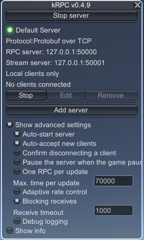
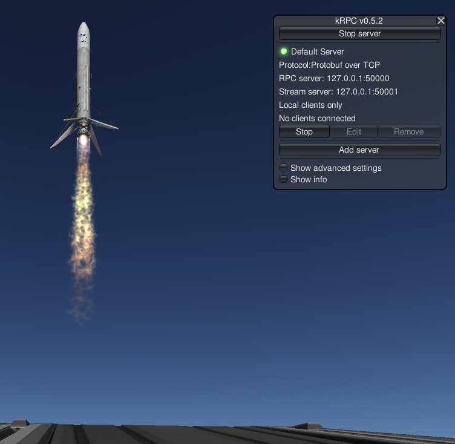

# ksp_bridge

ROS2 package for Kerbal Space Program based on the kRPC mod.

Works with:  

+ KSP 1.12.5

+ kRPC 0.5.2

+ ROS2 Humble

+ Ubuntu 22.04

## Installation

### Install kRPC mod

Install the [kRPC mod](https://github.com/nullprofile/krpc) and it's dependencies.

### Clone repository and build the docker container

``` bash
git clone https://github.com/clausqr/ksp_bridge
cd ksp_bridge
docker build -t ksp_bridge:humble .
```

## Usage

### 1. Server settings inside KSP





**Note**: *Max. time per update* is required to be high, but it affects the framerate.

### 2. Running the docker container

``` bash
xhost +local:docker
docker run -it --rm --net=host -e DISPLAY=$DISPLAY -v /tmp/.X11-unix:/tmp/.X11-unix ksp_bridge:humble
```

### 3. inside the docker container

Resource monitor example:
``` bash
ros2 launch ksp_bridge_examples resource_monitor.launch.py
```

or 

Up and Down Launch example:
``` bash
ros2 launch ksp_bridge_examples up_and_down.launch.py
``` 

### 4. Development

(for fast reference, your workflow may vary)

Mount the repository inside the docker container:
``` bash
docker run -it --rm --net=host -e DISPLAY=$DISPLAY -v /tmp/.X11-unix:/tmp/.X11-unix -v $(pwd):/ws/ksp_bridge ksp_bridge:humble
```

Code your custom packets outside the container and build and test inside the container with:

``` bash
cd /ws/ksp_bridge
colcon build
source install/setup.bash
rqt &
ros2 run ksp_bridge_<your_custom_packet> <your_custom_launch_file>.launch.py
```


